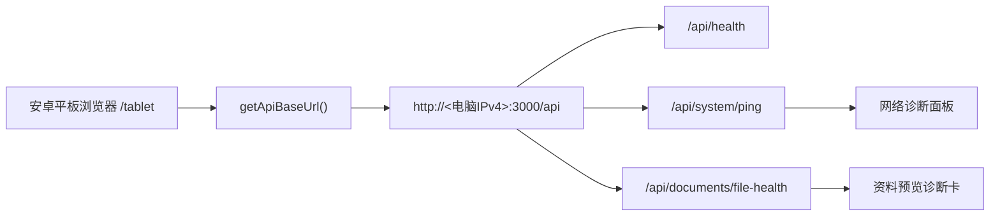

# V1.5 平板现场走查与局域网诊断

## 目标

V1.5 把 V1.4 的本地上传和预览能力推进到“安卓平板现场可演示”的状态，重点是局域网访问、网络诊断、现场走查、上传资料提示和预览诊断。

## 已完成范围

- 前端 API Base URL 集中到 `apps/tablet/src/config/api-base.ts`。
- 支持根据 `localhost` / 局域网主机名自动推导 API 地址。
- 后端支持 `HOST=0.0.0.0` 监听，并输出本机和局域网 API / Swagger 地址。
- 新增 `npm run dev:lan`、`npm run dev:tablet:lan`、`npm run dev:api:lan`。
- 新增 `npm run demo:check`，只读检查平板演示准备状态。
- 新增网络诊断面板，展示 API 地址、延迟、数据源、文件健康和混合内容风险。
- 新增现场走查面板，17 项检查保存在 `localStorage`。
- 上传弹窗增加 `demo-upload-assets` 推荐文件提示。
- 资料预览台增加当前资料诊断卡，展示 `previewUrl`、`downloadUrl`、`manual_upload`、`mock`、`canPreview` 和建议动作。
- 更新平板横屏下顶部状态栏、弹窗、标签页和触控按钮适配。

## 数据流



## 安全边界

- V1.5 不连接真实数据库。
- V1.5 不执行数据库迁移、db push、seed 或写库操作。
- V1.5 不连接企业微信微盘。
- V1.5 不连接真实语音平台。
- 本地上传文件仍在 `apps/api/storage/uploads`，被 `.gitignore` 忽略。
- metadata JSON 仍被 `.gitignore` 忽略。

## 验收命令

```bash
npm run demo:assets
npm run demo:check
npm run file-flow:check
npm run security:check
npm run build
npm run check
```

以上命令不包含数据库连接或写库命令。
